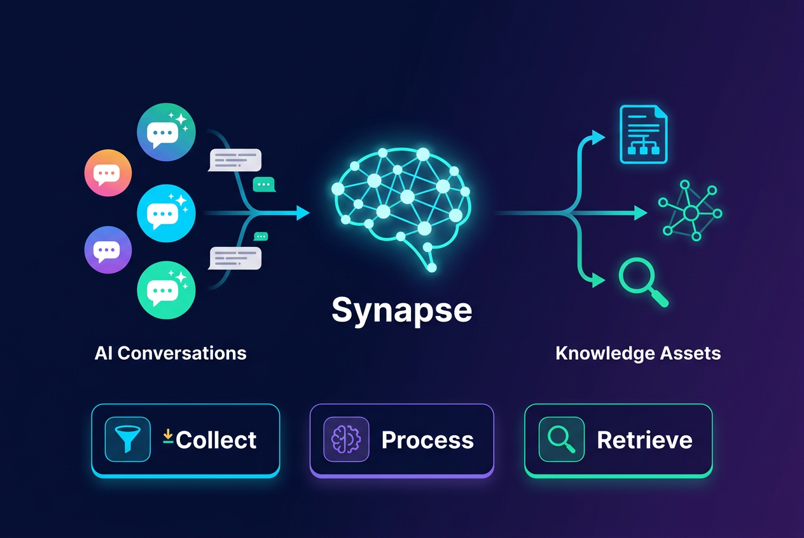
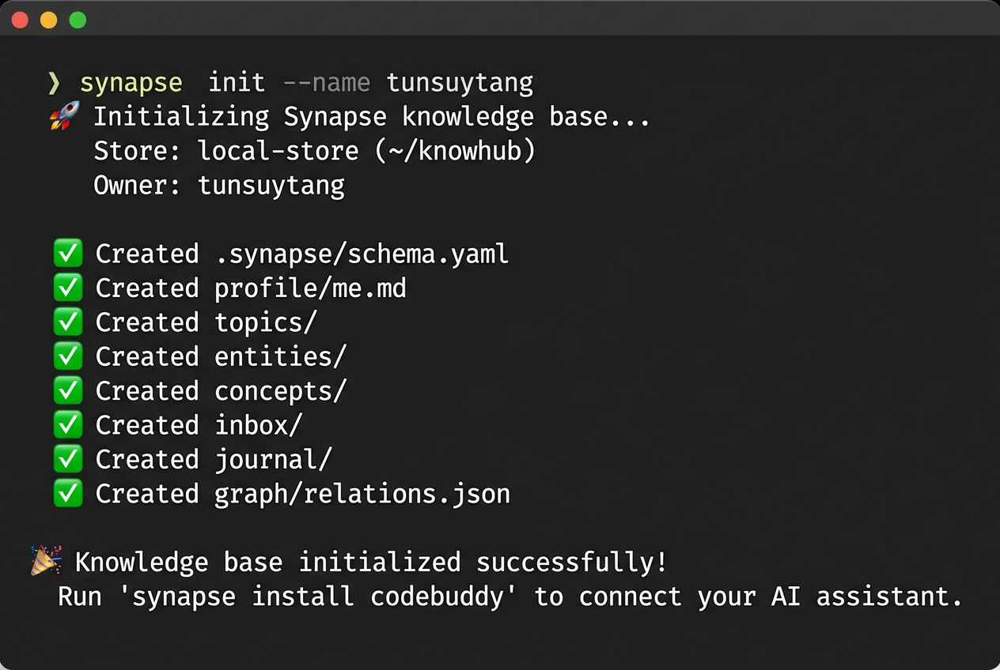
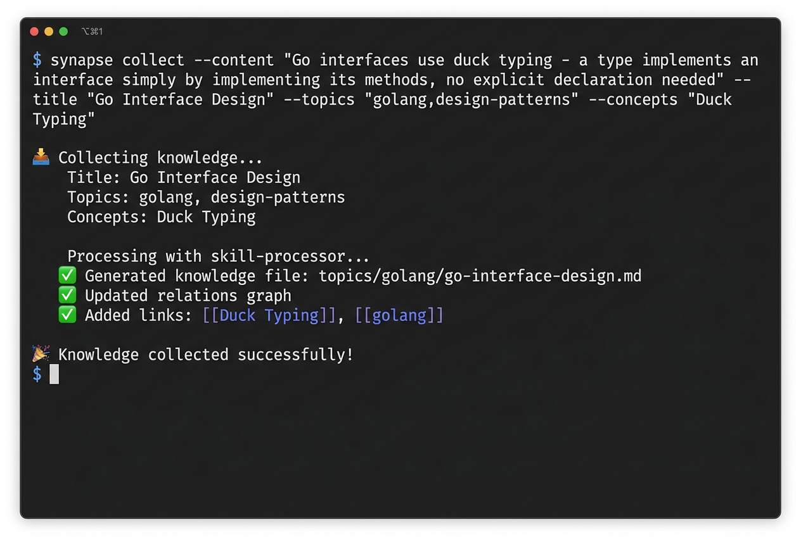
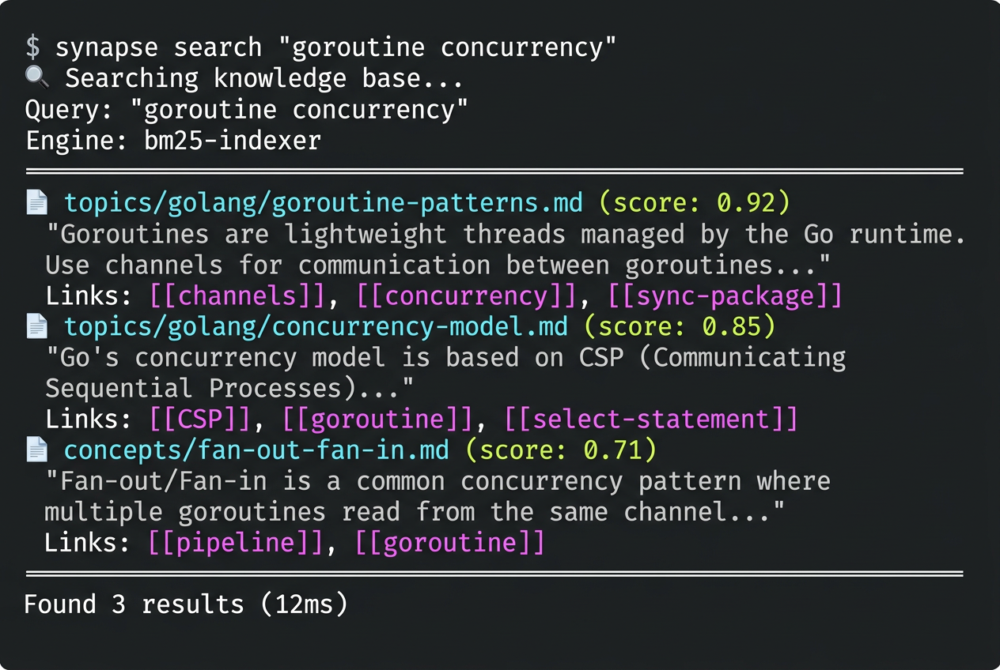
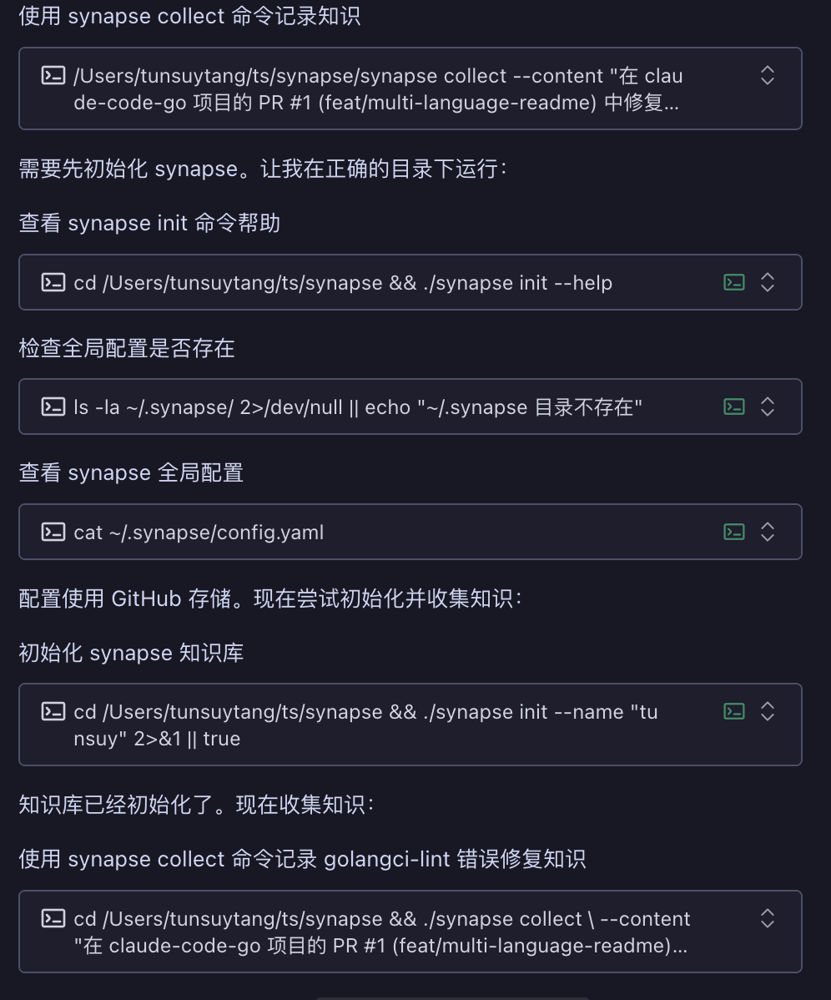

<p align="center">
  
</p>

<h1 align="center">Synapse</h1>

<p align="center">
  <strong>パーソナルナレッジハブ（Personal Knowledge Hub）</strong><br/>
  AIアシスタントとの会話から自動的にナレッジを蓄積・整理・活用し、すべてのAI会話をナレッジの複利に変えます。
</p>

<p align="center">
  
</p>

[](https://github.com/tunsuy/synapse/actions/workflows/ci.yml)
[](https://goreportcard.com/report/github.com/tunsuy/synapse)
[](https://codecov.io/gh/tunsuy/synapse)
[](https://pkg.go.dev/github.com/tunsuy/synapse)
[](https://github.com/tunsuy/synapse/releases)
[](https://go.dev/)
[](LICENSE)
[](CONTRIBUTING.md)

**言語: [简体中文](README_zh.md) | [English](README.md) | 日本語 | [한국어](README_ko.md) | [Français](README_fr.md) | [Español](README_es.md)**

---

## 🎯 なぜ Synapse が必要なのか？

私たちは日常の仕事や学習で様々なAIアシスタント（ChatGPT、Claude、CodeBuddy、Geminiなど）を使用しています。すべての会話は本質的にナレッジの蓄積です。しかし現実は：

- **ナレッジの断片化** — 各AIアシスタントに散在し、振り返りが困難
- **AI認知の断絶** — AIのあなたに対する理解は断片的で、毎回の会話がゼロからのスタート
- **ナレッジは"ダークアセット"** — 価値ある会話の成果物が使い捨てで忘れ去られる

**Synapse の目標**：AIとのすべての会話を、蓄積・検索・再活用できるナレッジ資産に変えること。

> "Wikiは永続的で、複利的に成長するナレッジプロダクトである。" — Andrej Karpathy

---

## ✨ コア機能

- 🔌 **拡張ポイントモデル** — 6つの独立した拡張ポイント（Source / Processor / Store / Indexer / Consumer / Auditor）、必要に応じて組み合わせ、独立して交換可能
- 📥 **マルチソース取り込み** — 任意のAIアシスタント、RSS、Notion、ポッドキャストなどからゼロフリクションでコンテンツを取得
- 🧠 **インテリジェント処理** — AIドリブンのナレッジ抽出・分類・関連付け、生の会話を構造化されたナレッジに自動変換
- 💾 **ストレージの自主性** — データは選択した任意のバックエンド（ローカル / GitHub / S3 / WebDAV）に保存、完全自己管理
- 🔍 **柔軟な検索** — プラガブルな検索エンジン（BM25 / ベクトル検索 / グラフトラバーサル）
- 📊 **多形態消費** — ナレッジを静的サイト、Obsidian Vault、Ankiフラッシュカード、メールダイジェストなどに出力
- 🔗 **双方向リンク** — `[[wiki-link]]` フォーマット、Obsidian互換、パーソナルナレッジグラフを構築
- 📋 **スキーマ駆動** — Schemaファイルを通じてAI動作契約を定義、Schemaを変更するだけですべてのAIアシスタントの動作を変更
- 🧩 **プラグインエコシステム** — 完全なプラグイン管理CLI、マルチソースインストール対応、コミュニティによる拡張ポイント実装

---

## 🏗️ アーキテクチャ概要

Synapse は **拡張ポイントモデル（Extension Point Model）** を採用 — Store を基盤とし、6つの独立した拡張ポイントを必要に応じて組み合わせるスター型アーキテクチャ：

```
                    ┌─────────────┐
                    │   Source     │  データソース（AI会話 / RSS / Notion / ...）
                    └──────┬──────┘
                           │ RawContent
                           ▼
                    ┌─────────────┐
                    │  Processor  │  処理エンジン（Skill / MCP / LocalLLM / ...）
                    └──────┬──────┘
                           │ KnowledgeFile
                           ▼
┌──────────────────────────────────────────────────────┐
│                  Store（ストレージ基盤）                  │
│        Local FS / GitHub / S3 / WebDAV / ...         │
└────────┬──────────────────┬──────────────────┬───────┘
         │                  │                  │
         ▼                  ▼                  ▼
  ┌─────────────┐   ┌─────────────┐   ┌───────────────┐
  │   Indexer    │   │   Auditor   │   │   Consumer    │
  │  検索エンジン │   │  品質監査    │   │   消費端      │
  └─────────────┘   └─────────────┘   └───────────────┘
```

> 詳細なアーキテクチャ説明は [ARCHITECTURE.md](ARCHITECTURE.md) を参照してください。

---

## 📸 デモ

### ナレッジベースの初期化

<p align="center">
  
</p>

### ナレッジの収集

<p align="center">
  
</p>

### ナレッジベースの検索

<p align="center">
  
</p>

### AIアシスタントでのSkill使用

CodeBuddy IDEでsynapse-knowledge skillを使用したインテリジェントなナレッジ管理：

<p align="center">
  
</p>

<p align="center">
  
</p>

---

## 🚀 クイックスタート

### 環境要件

- Go >= 1.24

### インストール

```bash
go install github.com/tunsuy/synapse@latest
```

### ナレッジベースの初期化

```bash
# 新しいナレッジベースを初期化
synapse init ~/knowhub

# ナレッジベースの構造を確認
tree ~/knowhub
```

### ナレッジベースのディレクトリ構造

```
knowhub/
├── .synapse/
│   ├── schema.yaml       # ナレッジスキーマ（動作契約）
│   └── config.yaml       # 拡張ポイント設定
├── profile/
│   └── me.md             # ユーザープロファイル
├── topics/               # トピックナレッジ
│   ├── golang/
│   ├── architecture/
│   └── ...
├── entities/             # エンティティページ（人物、ツール、プロジェクト）
├── concepts/             # コンセプトページ（技術概念、方法論）
├── inbox/                # 未整理コンテンツ
├── journal/              # タイムラインジャーナル
└── graph/
    └── relations.json    # ナレッジ関連グラフ
```

---

## 🔌 拡張ポイント

| 拡張ポイント | 責務 | デフォルト実装 | コミュニティ貢献 |
|------------|------|-------------|--------------|
| **Source** | 外部から生コンテンツを取得 | CodeBuddy Skill | RSS / Notion / Twitter / ポッドキャスト / WeChat... |
| **Processor** | 生コンテンツ → 構造化ナレッジ | Skill Processor | ローカルLLM / ルールエンジン / ハイブリッド... |
| **Store** | ナレッジファイルのCRUD + バージョン管理 | Local Store | GitHub / S3 / WebDAV / SQLite / IPFS... |
| **Indexer** | ナレッジベース検索 | BM25 Indexer | ベクトル検索 / グラフトラバーサル / Elasticsearch... |
| **Consumer** | ナレッジを各種消費形式に出力 | Hugo サイト | VitePress / Anki / メール / TUI... |
| **Auditor** | ナレッジベースの品質チェックと修復 | Default Auditor | カスタム監査ルール... |

---

## 🧩 プラグイン管理

Synapse はプラグインシステムを通じて機能を拡張します。完全なプラグイン管理は M3 で提供予定です：

```bash
# 登録済みの拡張プラグインを表示（利用可能）
synapse plugin list

# 以下のコマンドは M3 で実装予定：
# synapse plugin install github.com/example/synapse-rss-source  # Go module
# synapse plugin install --git https://github.com/example/xxx.git  # Git リポジトリ
# synapse plugin install --local ./my-custom-processor  # ローカルディレクトリ
# synapse plugin enable rss-source   # プラグイン有効化
# synapse plugin disable rss-source  # プラグイン無効化
# synapse plugin doctor              # プラグインヘルスチェック
```

---

## 📅 ロードマップ

| マイルストーン | 内容 | ステータス |
|-------------|------|----------|
| **M1 基盤構築** | Schemaスペック + 拡張ポイントインターフェース + CLI init/check | ✅ 完了 |
| **M2 Skill統合** | 初のSource + Processor + Store、E2Eパイプライン | ✅ 完了 |
| **M3 MCP + プラグイン管理** | MCP Server + GitHub Store + BM25 Indexer + プラグインCLI | 🔵 計画中 |
| **M4 マルチプラットフォーム** | Claude Code / Cursor / ChatGPT Source | 🔵 計画中 |
| **M5 Consumer実装** | Hugo サイト + Obsidian互換 + ナレッジグラフ | 🔵 計画中 |
| **M6+ コミュニティ** | プラグインマーケット + 全拡張ポイント開放 + コミュニティ | 🔵 長期計画 |

> 詳細なロードマップは [docs/roadmap.md](docs/roadmap.md) を参照してください。

---

## 🤝 コントリビューション

あらゆる形式の貢献を歓迎します！バグ報告、新機能の提案、コードの直接貢献など。

- 📖 [コントリビューションガイド](CONTRIBUTING.md) を読んで参加方法を確認
- 🏛️ [アーキテクチャガイド](ARCHITECTURE.md) を読んで技術設計を理解
- 📋 [行動規範](CODE_OF_CONDUCT.md) でコミュニティ規範を確認
- 🗺️ [ロードマップ](docs/roadmap.md) でプロジェクト計画を確認

### 貢献の方向性

すべての拡張ポイントで、コミュニティからの新しい実装を歓迎しています：

- 🔌 **Source プラグイン**：より多くのデータソースの接続（RSS、Notion、WeChat、ポッドキャスト...）
- ⚙️ **Processor プラグイン**：より多くの処理エンジンのサポート（ローカルLLM、ルールエンジン...）
- 💾 **Store プラグイン**：より多くのストレージバックエンドのサポート（S3、WebDAV、IPFS...）
- 🔍 **Indexer プラグイン**：より多くの検索エンジンのサポート（ベクトル検索、グラフトラバーサル...）
- 📊 **Consumer プラグイン**：より多くの出力形式のサポート（VitePress、Anki、TUI...）

---

## 📄 ライセンス

本プロジェクトは [Apache License 2.0](LICENSE) の下でオープンソースです。

---

## 💬 お問い合わせ

- **Issues**：[GitHub Issues](https://github.com/tunsuy/synapse/issues)
- **Discussions**：[GitHub Discussions](https://github.com/tunsuy/synapse/discussions)

---

> *Synapse — すべてのAI会話をナレッジの複利に。*
