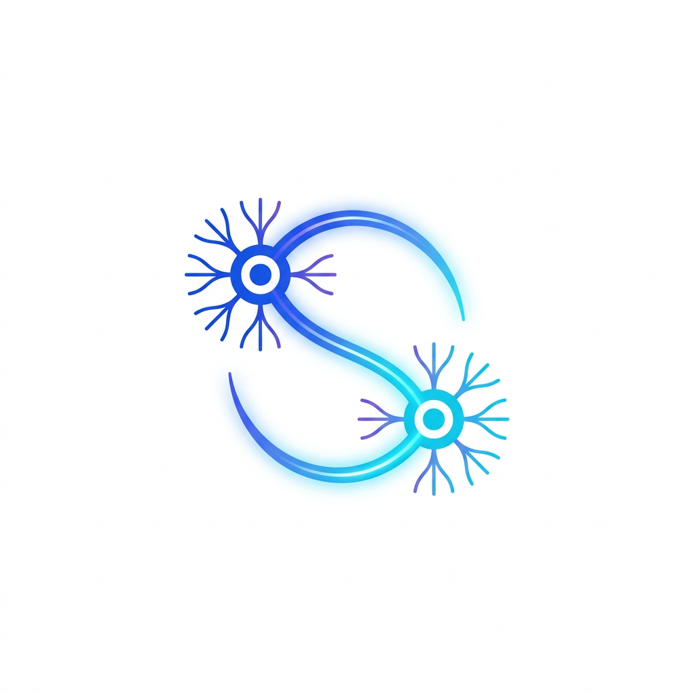

<p align="center">
  
</p>

<h1 align="center">Synapse</h1>

<p align="center">
  <strong>개인 지식 허브(Personal Knowledge Hub)</strong><br/>
  AI 어시스턴트와의 대화에서 자동으로 지식을 축적, 정리, 환원하여 모든 AI 대화를 지식 복리로 만듭니다.
</p>

[](https://go.dev/)
[](LICENSE)
[](CONTRIBUTING.md)

**언어: [简体中文](README.md) | [English](README_en.md) | [日本語](README_ja.md) | 한국어 | [Français](README_fr.md) | [Español](README_es.md)**

---

## 🎯 왜 Synapse가 필요한가?

우리는 일상 업무와 학습에서 다양한 AI 어시스턴트(ChatGPT, Claude, CodeBuddy, Gemini 등)를 사용합니다. 모든 대화는 본질적으로 지식의 축적입니다. 하지만 현실은:

- **지식의 단편화** — 여러 AI 어시스턴트에 흩어져 있어 되돌아보기 어려움
- **AI 인지 단절** — AI의 당신에 대한 이해가 단편적이며, 매번 대화가 처음부터 시작
- **지식은 "다크 에셋"** — 가치 있는 대화 산출물이 한번 사용 후 잊혀짐

**Synapse의 목표**: AI와의 모든 대화를 축적, 검색, 재활용 가능한 지식 자산으로 전환하는 것.

> "위키는 영속적이고 복리적으로 성장하는 지식 산물이다." — Andrej Karpathy

---

## ✨ 핵심 기능

- 🔌 **확장 포인트 모델** — 6개의 독립 확장 포인트(Source / Processor / Store / Indexer / Consumer / Auditor), 필요에 따라 조합하고 독립적으로 교체 가능
- 📥 **멀티 소스 수집** — 모든 AI 어시스턴트, RSS, Notion, 팟캐스트 등에서 제로 프릭션으로 콘텐츠 획득
- 🧠 **지능형 처리** — AI 기반 지식 추출, 분류, 연관, 원시 대화를 구조화된 지식으로 자동 변환
- 💾 **스토리지 자주성** — 데이터는 선택한 모든 백엔드(로컬 / GitHub / S3 / WebDAV)에 저장, 완전한 자기 제어
- 🔍 **유연한 검색** — 플러거블 검색 엔진(BM25 / 벡터 검색 / 그래프 탐색)
- 📊 **다형태 소비** — 지식을 정적 사이트, Obsidian Vault, Anki 플래시카드, 이메일 다이제스트 등으로 출력
- 🔗 **양방향 링크** — `[[wiki-link]]` 형식, Obsidian 호환, 개인 지식 그래프 구축
- 📋 **스키마 기반** — Schema 파일을 통해 AI 동작 계약을 정의, Schema 수정으로 모든 AI 어시스턴트의 동작 변경
- 🧩 **플러그인 생태계** — 완전한 플러그인 관리 CLI, 멀티 소스 설치 지원, 커뮤니티 기여 확장 포인트 구현

---

## 🏗️ 아키텍처 개요

Synapse는 **확장 포인트 모델(Extension Point Model)** 을 채택 — Store를 기반으로 6개의 독립 확장 포인트를 필요에 따라 조합하는 스타 아키텍처:

```
                    ┌─────────────┐
                    │   Source     │  데이터 소스(AI 대화 / RSS / Notion / ...)
                    └──────┬──────┘
                           │ RawContent
                           ▼
                    ┌─────────────┐
                    │  Processor  │  처리 엔진(Skill / MCP / LocalLLM / ...)
                    └──────┬──────┘
                           │ KnowledgeFile
                           ▼
┌──────────────────────────────────────────────────────┐
│                  Store(스토리지 기반)                    │
│        Local FS / GitHub / S3 / WebDAV / ...         │
└────────┬──────────────────┬──────────────────┬───────┘
         │                  │                  │
         ▼                  ▼                  ▼
  ┌─────────────┐   ┌─────────────┐   ┌───────────────┐
  │   Indexer    │   │   Auditor   │   │   Consumer    │
  │  검색 엔진   │   │  품질 감사   │   │   소비 단말    │
  └─────────────┘   └─────────────┘   └───────────────┘
```

> 자세한 아키텍처 설명은 [ARCHITECTURE.md](ARCHITECTURE.md)를 참조하세요.

---

## 🚀 빠른 시작

### 환경 요구사항

- Go >= 1.21

### 설치

```bash
go install github.com/tunsuy/synapse@latest
```

### 지식 베이스 초기화

```bash
# 새로운 지식 베이스 초기화
synapse init ~/knowhub

# 지식 베이스 구조 확인
tree ~/knowhub
```

### 지식 베이스 디렉토리 구조

```
knowhub/
├── .synapse/
│   ├── schema.yaml       # 지식 스키마(동작 계약)
│   └── config.yaml       # 확장 포인트 설정
├── profile/
│   └── me.md             # 사용자 프로필
├── topics/               # 주제 지식
│   ├── golang/
│   ├── architecture/
│   └── ...
├── entities/             # 엔티티 페이지(인물, 도구, 프로젝트)
├── concepts/             # 개념 페이지(기술 개념, 방법론)
├── inbox/                # 미정리 콘텐츠
├── journal/              # 타임라인 저널
└── graph/
    └── relations.json    # 지식 관계 그래프
```

---

## 🔌 확장 포인트

| 확장 포인트 | 책임 | 기본 구현 | 커뮤니티 기여 |
|-----------|------|---------|------------|
| **Source** | 외부에서 원시 콘텐츠 가져오기 | CodeBuddy Skill | RSS / Notion / Twitter / 팟캐스트 / WeChat... |
| **Processor** | 원시 콘텐츠 → 구조화 지식 | Skill Processor | 로컬 LLM / 규칙 엔진 / 하이브리드... |
| **Store** | 지식 파일의 CRUD + 버전 관리 | Local Store | GitHub / S3 / WebDAV / SQLite / IPFS... |
| **Indexer** | 지식 베이스 검색 | BM25 Indexer | 벡터 검색 / 그래프 탐색 / Elasticsearch... |
| **Consumer** | 지식을 다양한 소비 형식으로 출력 | Hugo 사이트 | VitePress / Anki / 이메일 / TUI... |
| **Auditor** | 지식 베이스 품질 검사 및 수정 | Default Auditor | 커스텀 감사 규칙... |

---

## 🧩 플러그인 관리

```bash
# 설치된 플러그인 목록 보기
synapse plugin list

# Go module에서 설치
synapse plugin install github.com/example/synapse-rss-source

# Git 저장소에서 설치
synapse plugin install --git https://github.com/example/synapse-vector-indexer.git

# 로컬 디렉토리에서 설치
synapse plugin install --local ./my-custom-processor

# 플러그인 활성화 / 비활성화
synapse plugin enable rss-source
synapse plugin disable rss-source

# 플러그인 헬스 체크
synapse plugin doctor
```

---

## 📅 로드맵

| 마일스톤 | 내용 | 상태 |
|---------|------|------|
| **M1 기반 구축** | Schema 스펙 + 확장 포인트 인터페이스 + CLI init | 🟡 미착수 |
| **M2 Skill 통합** | 첫 Source + Processor + Store, E2E 파이프라인 | 🟡 미착수 |
| **M3 MCP + 플러그인 관리** | MCP Server + GitHub Store + BM25 Indexer + 플러그인 CLI | 🔵 계획 중 |
| **M4 멀티 플랫폼** | Claude Code / Cursor / ChatGPT Source | 🔵 계획 중 |
| **M5 Consumer 구현** | Hugo 사이트 + Obsidian 호환 + 지식 그래프 | 🔵 계획 중 |
| **M6+ 커뮤니티** | 플러그인 마켓 + 전체 확장 포인트 개방 + 커뮤니티 | 🔵 장기 계획 |

> 상세 로드맵은 [docs/roadmap.md](docs/roadmap.md)를 참조하세요.

---

## 🤝 기여하기

모든 형태의 기여를 환영합니다! 버그 리포트 제출, 새 기능 제안, 코드 직접 기여 등.

- 📖 [기여 가이드](CONTRIBUTING.md)를 읽고 참여 방법을 확인하세요
- 🏛️ [아키텍처 가이드](ARCHITECTURE.md)를 읽고 기술 설계를 이해하세요
- 📋 [행동 강령](CODE_OF_CONDUCT.md)에서 커뮤니티 규범을 확인하세요
- 🗺️ [로드맵](docs/roadmap.md)에서 프로젝트 계획을 확인하세요

### 기여 방향

모든 확장 포인트에서 커뮤니티의 새로운 구현을 환영합니다:

- 🔌 **Source 플러그인**: 더 많은 데이터 소스 연결 (RSS, Notion, WeChat, 팟캐스트...)
- ⚙️ **Processor 플러그인**: 더 많은 처리 엔진 지원 (로컬 LLM, 규칙 엔진...)
- 💾 **Store 플러그인**: 더 많은 스토리지 백엔드 지원 (S3, WebDAV, IPFS...)
- 🔍 **Indexer 플러그인**: 더 많은 검색 엔진 지원 (벡터 검색, 그래프 탐색...)
- 📊 **Consumer 플러그인**: 더 많은 출력 형식 지원 (VitePress, Anki, TUI...)

---

## 📄 라이선스

이 프로젝트는 [Apache License 2.0](LICENSE) 하에 오픈소스로 공개됩니다.

---

## 💬 문의

- **Issues**: [GitHub Issues](https://github.com/tunsuy/synapse/issues)
- **Discussions**: [GitHub Discussions](https://github.com/tunsuy/synapse/discussions)

---

> *Synapse — 모든 AI 대화를 지식 복리로.*
